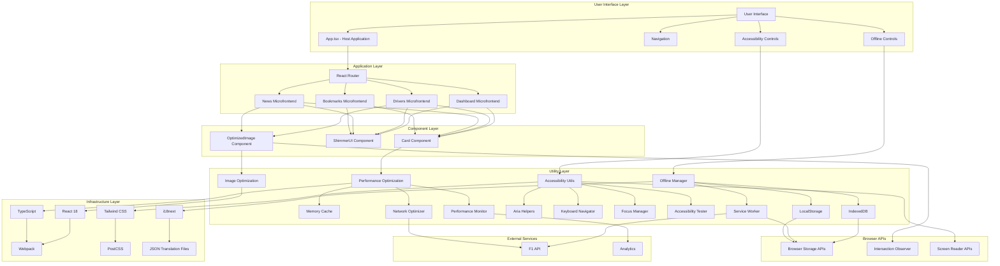
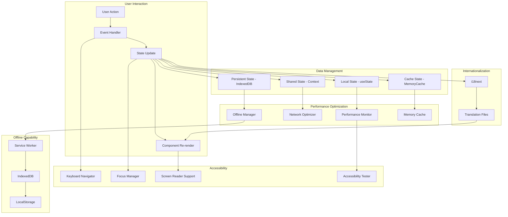
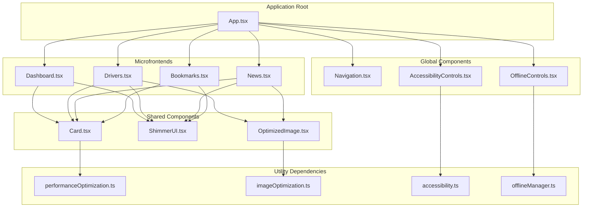
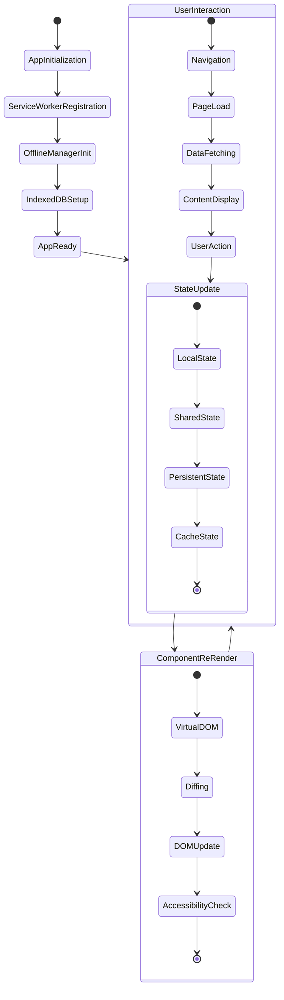
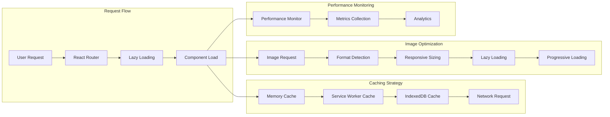
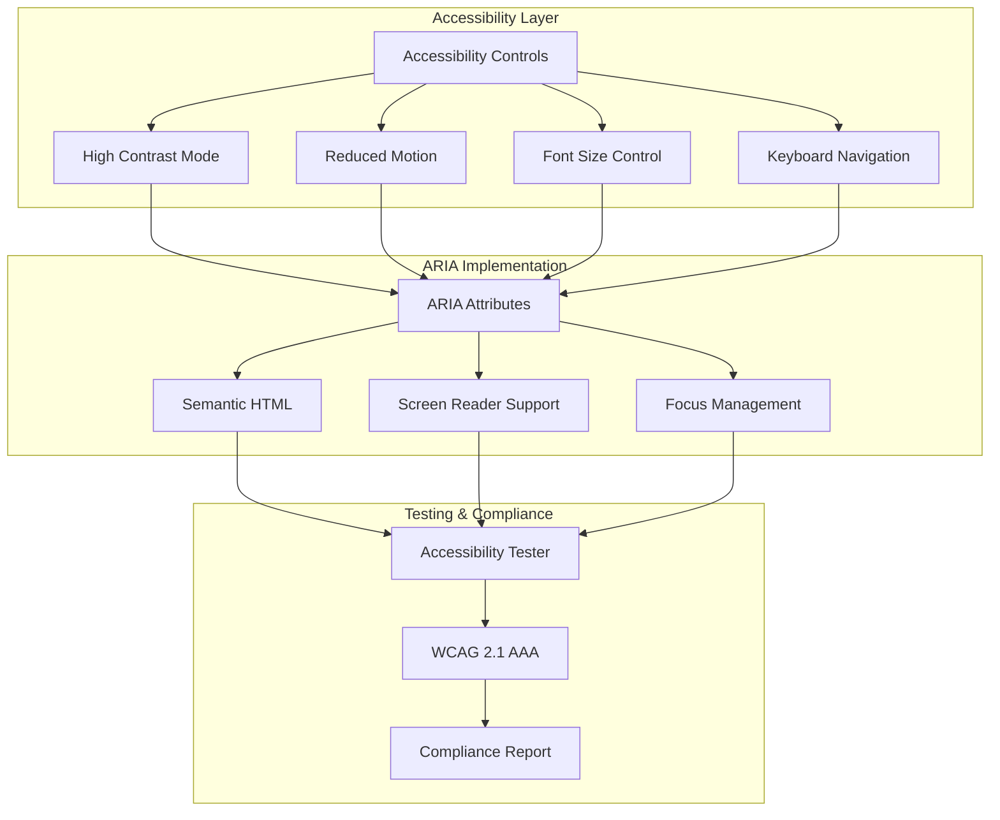
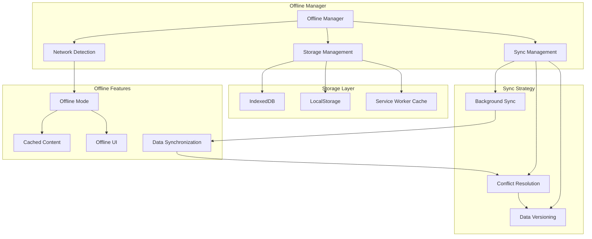
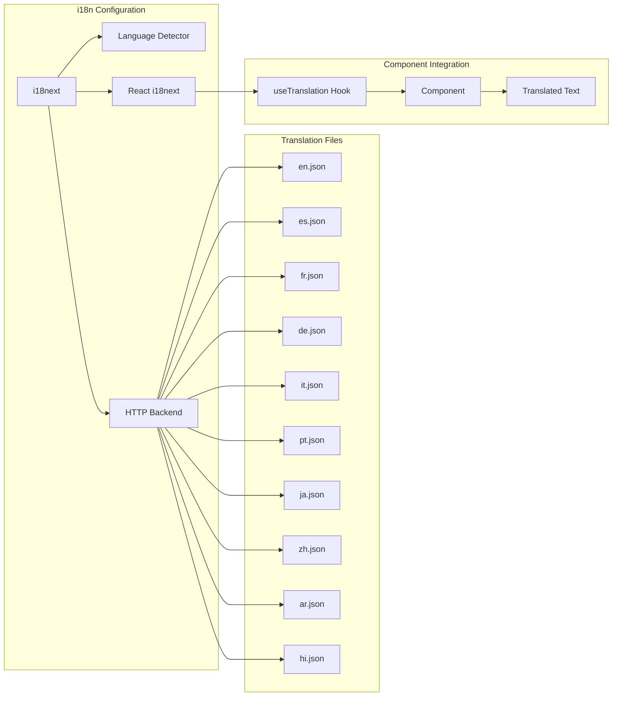
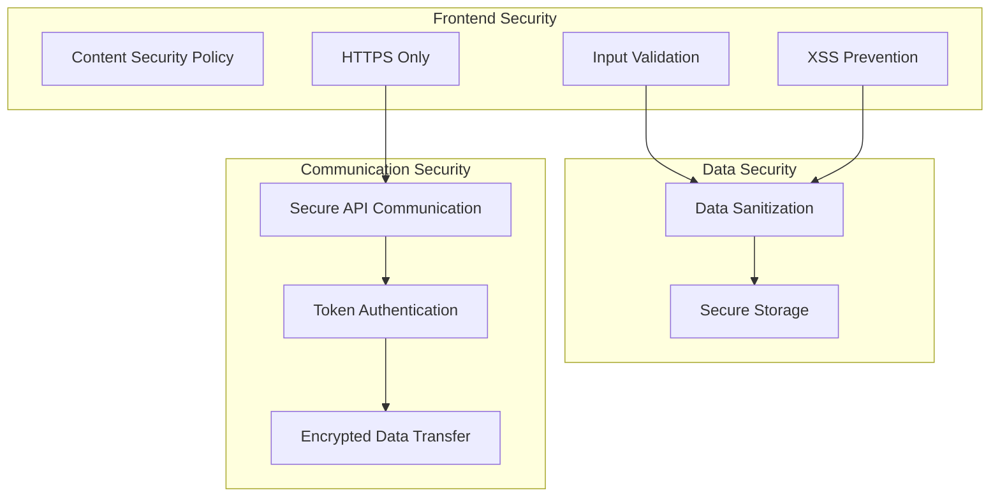
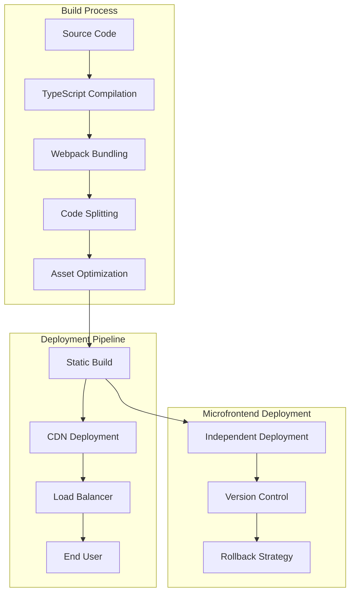

# ABC Racing - Visual Architecture Diagram

## System Architecture Overview

## Data Flow Architecture

## Component Hierarchy

## State Management Architecture

## Performance Optimization Flow

## Accessibility Architecture

## Offline Architecture

## Internationalization Flow

## Security Architecture

## Deployment Architecture

## Key Architectural Benefits

### 1. **Separation of Concerns**
- Clear boundaries between layers
- Single responsibility principle
- Modular and testable components

### 2. **Maintainability**
- TypeScript for type safety
- Consistent coding patterns
- Comprehensive documentation
- Clear component hierarchy

### 3. **Extensibility**
- Plugin architecture
- Configuration-driven features
- API-ready design
- Third-party integration support

### 4. **Scalability**
- Microfrontend architecture
- Lazy loading and code splitting
- Performance optimization
- Caching strategies

### 5. **Accessibility**
- AAA-level compliance
- Universal design principles
- Screen reader support
- Keyboard navigation

### 6. **Performance**
- Multi-layer caching
- Image optimization
- Progressive loading
- Performance monitoring

### 7. **Offline Capability**
- Progressive Web App features
- Service Worker integration
- IndexedDB for data persistence
- Background sync capabilities

This architecture provides a robust foundation for a high-traffic, feature-rich F1 racing application that can scale with user growth while maintaining excellent performance, accessibility, and user experience standards.
