# ABC Racing - Visual Architecture Diagram

## System Architecture Overview

```mermaid
graph TB
    subgraph "User Interface Layer"
        UI[User Interface]
        UI --> App
        UI --> Nav[Navigation with i18n]
        UI --> LS[Language Selector]
        UI --> AC[Accessibility Controls]
        UI --> OC[Offline Controls]
    end

    subgraph "Application Layer"
        App[App.tsx - Host Application]
        App --> Router[React Router]
        Router --> MF1[Dashboard Microfrontend]
        Router --> MF2[Drivers Microfrontend]
        Router --> MF3[News Microfrontend]
        Router --> MF4[Bookmarks Microfrontend]
    end

    subgraph "Component Layer"
        MF1 --> Card[Enhanced Card Component]
        MF2 --> Card
        MF3 --> Card
        MF4 --> Card
        
        MF1 --> Shimmer[ShimmerUI Component]
        MF2 --> Shimmer
        MF3 --> Shimmer
        MF4 --> Shimmer
        
        Card --> CardHooks[Card Custom Hooks]
        CardHooks --> useBookmark[useBookmark]
        CardHooks --> useCardInteraction[useCardInteraction]
        CardHooks --> useCardFilter[useCardFilter]
        CardHooks --> useCardGrid[useCardGrid]
        CardHooks --> useCardAnimation[useCardAnimation]
    end

    subgraph "Performance Layer"
        MF2 --> PerformanceHOCs[Performance HOCs]
        PerformanceHOCs --> withMemo[withMemo]
        PerformanceHOCs --> withPerformanceMonitoring[withPerformanceMonitoring]
        PerformanceHOCs --> withMobileOptimization[withMobileOptimization]
        PerformanceHOCs --> withErrorBoundary[withErrorBoundary]
        PerformanceHOCs --> composeHOCs[composeHOCs]
    end

    subgraph "Utility Layer"
        Card --> CardHooks
        AC --> A11Y[Accessibility Utils]
        OC --> OfflineHooks[Offline Custom Hooks]
        OfflineHooks --> useOfflineStatus[useOfflineStatus]
        OfflineHooks --> useOfflineContent[useOfflineContent]
        OfflineHooks --> useStorageUsage[useStorageUsage]
        OfflineHooks --> useOfflinePreferences[useOfflinePreferences]
        OfflineHooks --> useContentCaching[useContentCaching]
        OfflineHooks --> useSyncOperations[useSyncOperations]
        OfflineHooks --> useDatabaseOperations[useDatabaseOperations]
        
        A11Y --> AH[Aria Helpers]
        A11Y --> KN[Keyboard Navigator]
        A11Y --> FM[Focus Manager]
        A11Y --> AT[Accessibility Tester]
        
        OfflineHooks --> OM[Offline Manager]
        OM --> IDB[IndexedDB]
        OM --> SW[Service Worker]
        OM --> LS[LocalStorage]
    end

    subgraph "Internationalization Layer"
        i18n[i18next Configuration]
        i18n --> LanguageDetector[Language Detector]
        i18n --> TranslationFiles[Translation Files]
        TranslationFiles --> EN[en.json]
        TranslationFiles --> ES[es.json]
        TranslationFiles --> FR[fr.json]
        TranslationFiles --> DE[de.json]
        TranslationFiles --> IT[it.json]
        TranslationFiles --> PT[pt.json]
        TranslationFiles --> JA[ja.json]
        TranslationFiles --> ZH[zh.json]
        TranslationFiles --> AR[ar.json]
        TranslationFiles --> HI[hi.json]
        
        Nav --> i18n
        LS --> i18n
        MF1 --> i18n
        MF2 --> i18n
        MF3 --> i18n
        MF4 --> i18n
    end

    subgraph "Infrastructure Layer"
        CardHooks --> React[React 18]
        PerformanceHOCs --> TypeScript[TypeScript]
        A11Y --> Tailwind[Tailwind CSS]
        OfflineHooks --> React
        
        React --> Webpack[Webpack]
        TypeScript --> Webpack
        Tailwind --> PostCSS[PostCSS]
    end

    subgraph "External Services"
        SW --> API[F1 API]
        PerformanceHOCs --> Analytics[Performance Analytics]
    end

    subgraph "Browser APIs"
        IDB --> Browser[Browser Storage APIs]
        SW --> Browser
        LS --> Browser
        CardHooks --> IntersectionObserver[Intersection Observer]
        A11Y --> ScreenReader[Screen Reader APIs]
    end
```

## Data Flow Architecture

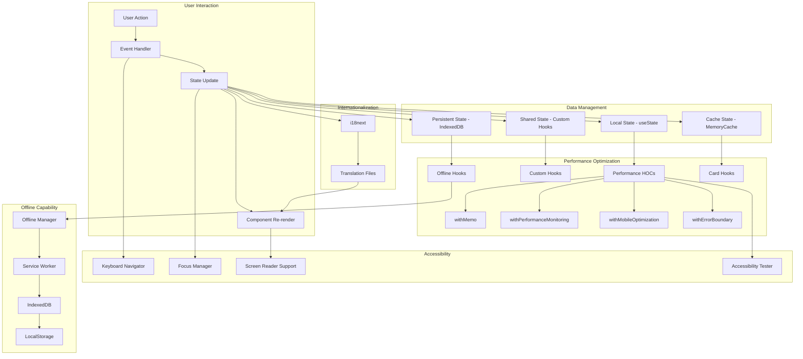

## Component Hierarchy

```mermaid
graph TD
    subgraph "Application Root"
        App[App.tsx]
    end

    subgraph "Global Components"
        App --> Navigation[Navigation.tsx with i18n]
        App --> LanguageSelector[LanguageSelector.tsx]
        App --> AccessibilityControls[AccessibilityControls.tsx]
        App --> OfflineControls[OfflineControls.tsx with Offline Hooks]
    end

    subgraph "Microfrontends"
        App --> Dashboard[Dashboard.tsx with Enhanced Card]
        App --> Drivers[Drivers.tsx with Performance HOCs + Enhanced Card]
        App --> News[News.tsx with Enhanced Card + Pagination]
        App --> Bookmarks[Bookmarks.tsx with Enhanced Card]
    end

    subgraph "Shared Components"
        Dashboard --> Card[Enhanced Card.tsx]
        Drivers --> Card
        News --> Card
        Bookmarks --> Card
        
        Dashboard --> ShimmerUI[ShimmerUI.tsx]
        Drivers --> ShimmerUI
        News --> ShimmerUI
        Bookmarks --> ShimmerUI
    end

    subgraph "Custom Hooks Layer"
        Card --> CardHooks[cardHooks.ts]
        CardHooks --> useBookmark[useBookmark]
        CardHooks --> useCardInteraction[useCardInteraction]
        CardHooks --> useCardFilter[useCardFilter]
        CardHooks --> useCardGrid[useCardGrid]
        CardHooks --> useCardAnimation[useCardAnimation]
        
        OfflineControls --> OfflineHooks[offlineHooks.ts]
        OfflineHooks --> useOfflineStatus[useOfflineStatus]
        OfflineHooks --> useOfflineContent[useOfflineContent]
        OfflineHooks --> useStorageUsage[useStorageUsage]
        OfflineHooks --> useOfflinePreferences[useOfflinePreferences]
        OfflineHooks --> useContentCaching[useContentCaching]
        OfflineHooks --> useSyncOperations[useSyncOperations]
        OfflineHooks --> useDatabaseOperations[useDatabaseOperations]
    end

    subgraph "Performance & Utility Layer"
        Drivers --> PerformanceHOCs[performanceHOCs.tsx]
        PerformanceHOCs --> withMemo[withMemo]
        PerformanceHOCs --> withPerformanceMonitoring[withPerformanceMonitoring]
        PerformanceHOCs --> withMobileOptimization[withMobileOptimization]
        PerformanceHOCs --> withErrorBoundary[withErrorBoundary]
        PerformanceHOCs --> composeHOCs[composeHOCs]
        
        OfflineHooks --> OfflineManager[offlineManager.ts]
        OfflineManager --> IndexedDB[IndexedDB]
        OfflineManager --> ServiceWorker[Service Worker]
        
        Navigation --> i18n[i18n Configuration]
        i18n --> TranslationFiles[Translation Files]
    end
```

## State Management Architecture

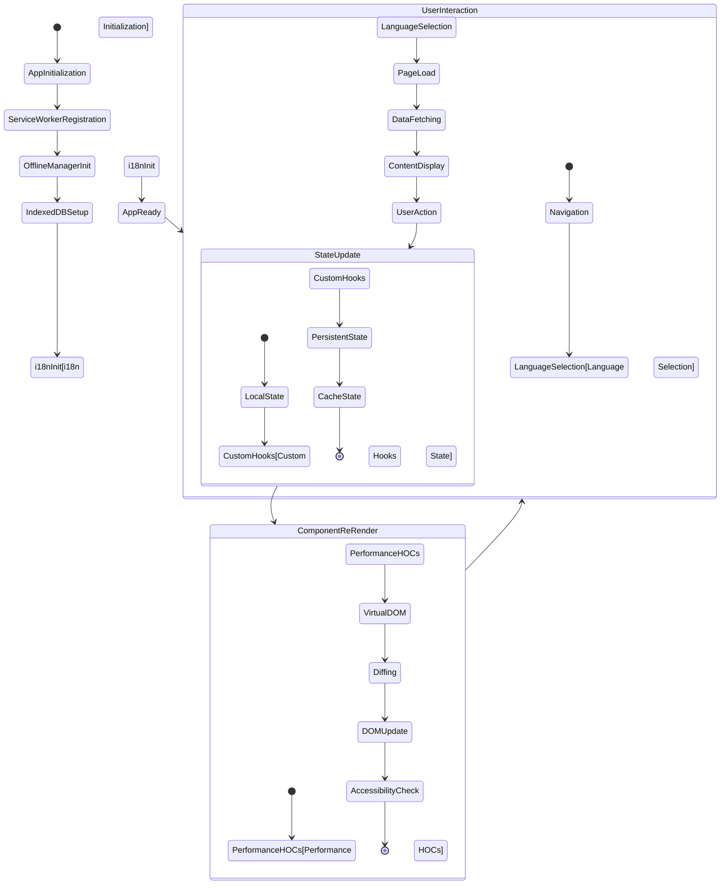

## Performance Optimization Flow

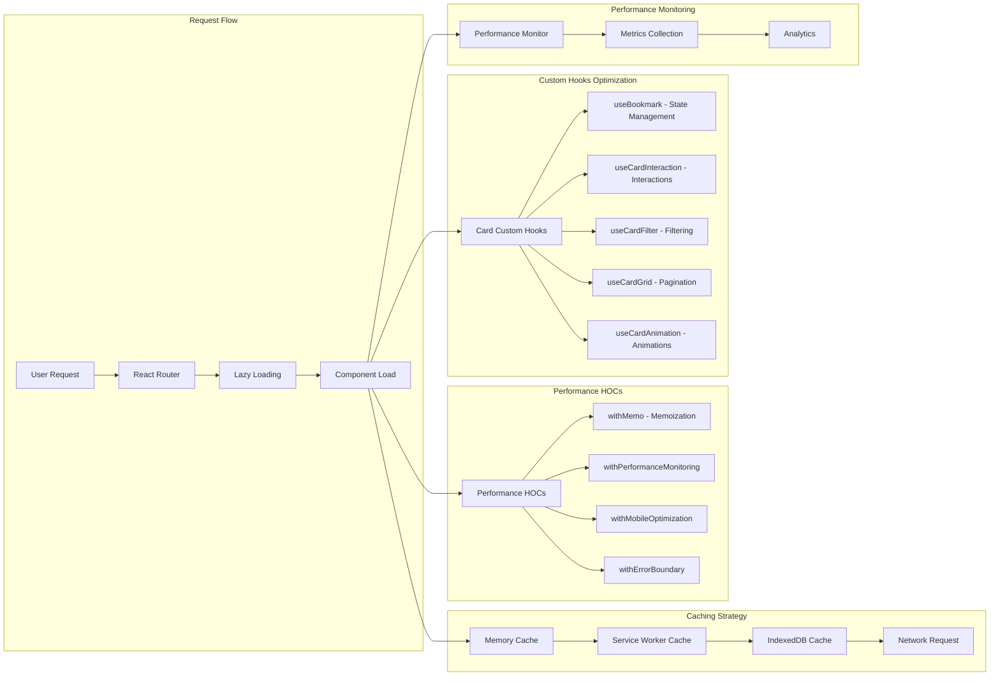

## Enhanced Card Component Architecture

```mermaid
graph TB
    subgraph "Card Component"
        Card[Enhanced Card.tsx]
        Card --> Variants[Variants: default, elevated, outlined, filled]
        Card --> Sizes[Sizes: sm, md, lg]
        Card --> Props[Enhanced Props: id, variant, size, disabled, loading, selected]
        Card --> Accessibility[Accessibility: role, tabIndex, aria-*]
    end

    subgraph "Card Custom Hooks"
        Card --> CardHooks[cardHooks.ts]
        CardHooks --> useBookmark[useBookmark]
        CardHooks --> useCardInteraction[useCardInteraction]
        CardHooks --> useCardFilter[useCardFilter]
        CardHooks --> useCardGrid[useCardGrid]
        CardHooks --> useCardAnimation[useCardAnimation]
    end

    subgraph "Card Usage in Microfrontends"
        Card --> DashboardUsage[Dashboard - Quick Stats, Season Progress]
        Card --> DriversUsage[Drivers - Driver Profiles, Team Filtering]
        Card --> NewsUsage[News - Articles, Pagination, Categories]
        Card --> BookmarksUsage[Bookmarks - Saved Content Display]
    end

    subgraph "Card Features"
        Variants --> Styling[Conditional Styling]
        Sizes --> Responsive[Responsive Design]
        Props --> States[Multiple States]
        Accessibility --> ScreenReader[Screen Reader Support]
    end
```

## Offline Architecture with Custom Hooks

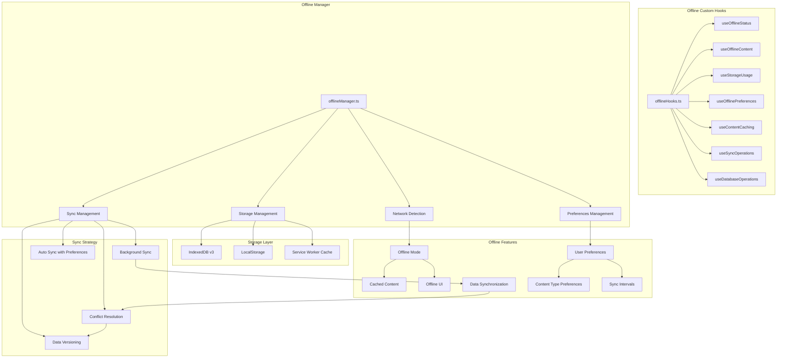

## Internationalization Flow

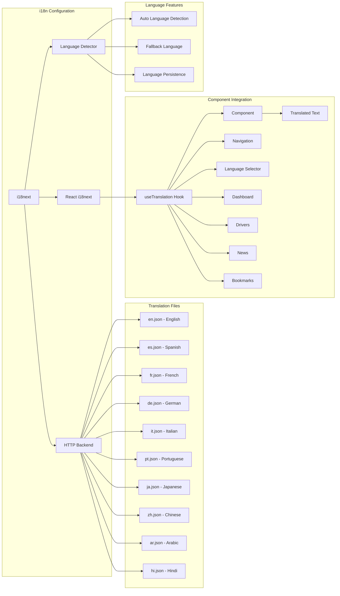

## Performance HOCs Architecture

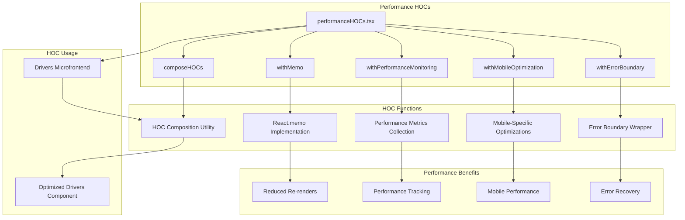

## Security Architecture

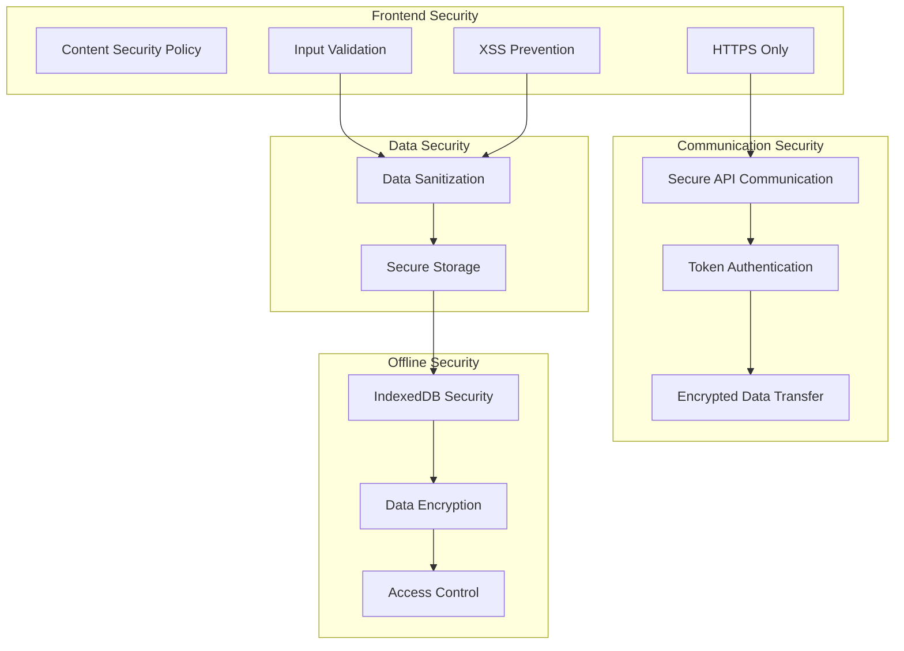

## Deployment Architecture

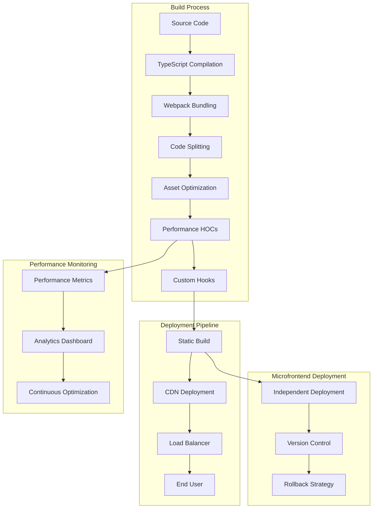

## Key Architectural Benefits

### 1. **Separation of Concerns**
- Clear boundaries between layers
- Single responsibility principle
- Modular and testable components
- Custom hooks for specific functionality

### 2. **Maintainability**
- TypeScript for type safety
- Consistent coding patterns
- Comprehensive documentation
- Clear component hierarchy
- Reusable custom hooks

### 3. **Extensibility**
- Plugin architecture with HOCs
- Configuration-driven features
- API-ready design
- Third-party integration support
- Custom hook composition

### 4. **Scalability**
- Microfrontend architecture
- Lazy loading and code splitting
- Performance optimization with HOCs
- Caching strategies
- Custom hooks for state management

### 5. **Accessibility**
- AAA-level compliance
- Universal design principles
- Screen reader support
- Keyboard navigation
- ARIA implementation

### 6. **Performance**
- Multi-layer caching
- Performance HOCs for optimization
- Custom hooks for efficient state management
- Progressive loading
- Performance monitoring and metrics

### 7. **Offline Capability**
- Progressive Web App features
- Service Worker integration
- IndexedDB for data persistence
- Background sync capabilities
- Custom hooks for offline management

### 8. **Internationalization**
- 10-language support
- Automatic language detection
- Fallback language support
- Component-level translation
- Language persistence

### 9. **Component Architecture**
- Enhanced Card component with variants
- Custom hooks for Card functionality
- Flexible prop system
- Accessibility features
- Performance optimization

This architecture provides a robust foundation for a high-traffic, feature-rich F1 racing application that can scale with user growth while maintaining excellent performance, accessibility, and user experience standards. The integration of performance HOCs, custom hooks, and enhanced components creates a maintainable and extensible codebase.
