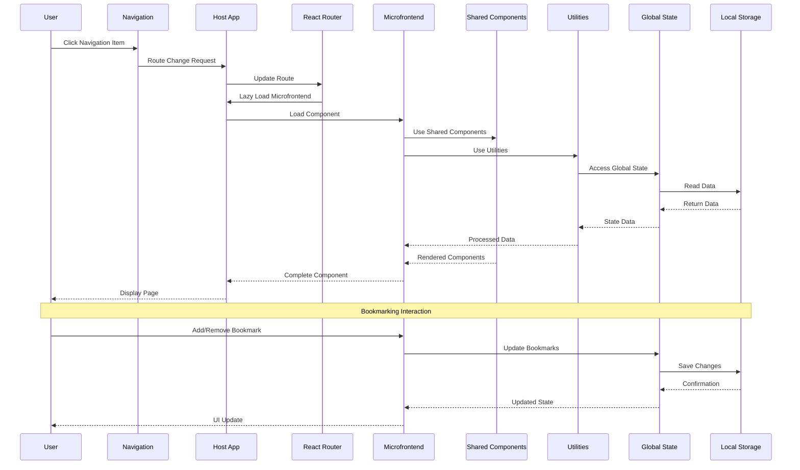
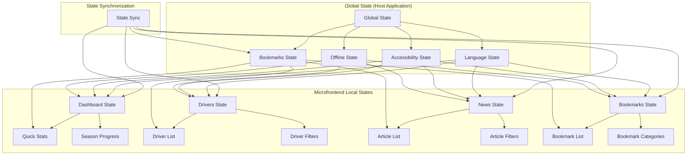
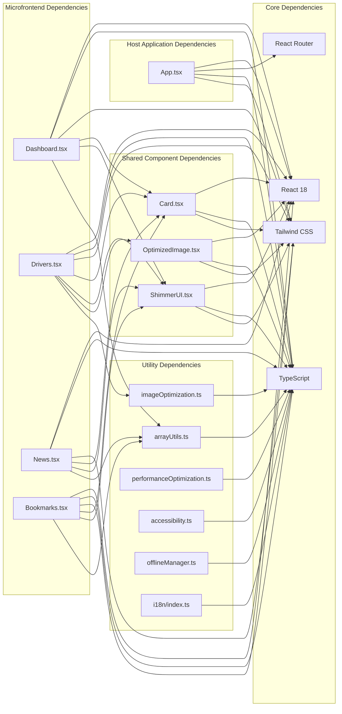
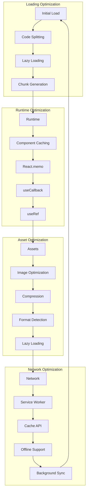
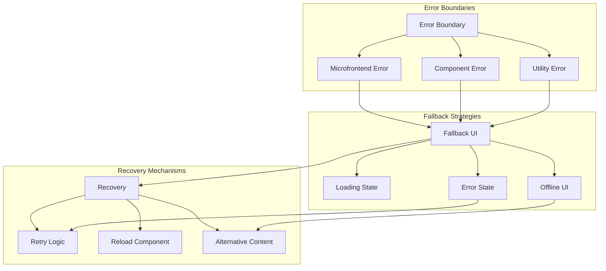

# ABC Racing - Microfrontend Component Interaction Diagram

## Component Interaction Overview

```mermaid
graph TB
    subgraph "User Interface Layer"
        UI[User Interface]
        UI --> NAV[Navigation Bar]
        UI --> CONTENT[Content Area]
        UI --> CONTROLS[Global Controls]
    end

    subgraph "Host Application (App.tsx)"
        HOST[Host Application]
        HOST --> ROUTER[React Router]
        ROUTER --> LAZY_LOAD[Lazy Loading Manager]
        HOST --> GLOBAL_STATE[Global State Manager]
    end

    subgraph "Microfrontend Container"
        MF_CONTAINER[Microfrontend Container]
        MF_CONTAINER --> DASHBOARD[Dashboard MF]
        MF_CONTAINER --> DRIVERS[Drivers MF]
        MF_CONTAINER --> NEWS[News MF]
        MF_CONTAINER --> BOOKMARKS[Bookmarks MF]
    end

    subgraph "Shared Component Library"
        SHARED[Shared Components]
        SHARED --> CARD[Card Component]
        SHARED --> SHIMMER[ShimmerUI]
        SHARED --> IMAGE[OptimizedImage]
        SHARED --> LANG[LanguageSelector]
    end

    subgraph "Utility Services"
        UTILS[Utility Services]
        UTILS --> ARRAY[Array Utils]
        UTILS --> IMG_OPT[Image Optimization]
        UTILS --> PERF[Performance Utils]
        UTILS --> ACCESS[Accessibility Utils]
        UTILS --> OFFLINE[Offline Manager]
        UTILS --> I18N[I18n Service]
    end

    subgraph "Data Layer"
        DATA[Data Layer]
        DATA --> BOOKMARKS_STATE[Bookmarks State]
        DATA --> OFFLINE_STORAGE[Offline Storage]
        DATA --> LOCALIZATION[Localization Data]
        DATA --> USER_PREFS[User Preferences]
    end

    %% User Interface connections
    UI --> HOST
    NAV --> ROUTER
    CONTENT --> MF_CONTAINER
    CONTROLS --> UTILS

    %% Host to Microfrontends
    LAZY_LOAD --> DASHBOARD
    LAZY_LOAD --> DRIVERS
    LAZY_LOAD --> NEWS
    LAZY_LOAD --> BOOKMARKS

    %% Microfrontends to Shared Components
    DASHBOARD --> CARD
    DASHBOARD --> SHIMMER
    DRIVERS --> CARD
    DRIVERS --> SHIMMER
    DRIVERS --> IMAGE
    NEWS --> CARD
    NEWS --> SHIMMER
    BOOKMARKS --> CARD
    BOOKMARKS --> SHIMMER

    %% Microfrontends to Utilities
    DASHBOARD --> ARRAY
    DRIVERS --> IMG_OPT
    NEWS --> ARRAY
    BOOKMARKS --> ARRAY

    %% Global State connections
    GLOBAL_STATE --> BOOKMARKS_STATE
    GLOBAL_STATE --> USER_PREFS

    %% Data connections
    DASHBOARD --> BOOKMARKS_STATE
    DRIVERS --> BOOKMARKS_STATE
    NEWS --> BOOKMARKS_STATE
    BOOKMARKS --> BOOKMARKS_STATE

    %% Utility to Data connections
    OFFLINE --> OFFLINE_STORAGE
    I18N --> LOCALIZATION
    ACCESS --> USER_PREFS

    %% Styling
    classDef ui fill:#e3f2fd
    classDef host fill:#f3e5f5
    classDef mf fill:#e8f5e8
    classDef shared fill:#fff3e0
    classDef utility fill:#fce4ec
    classDef data fill:#f1f8e9

    class UI,NAV,CONTENT,CONTROLS ui
    class HOST,ROUTER,LAZY_LOAD,GLOBAL_STATE host
    class MF_CONTAINER,DASHBOARD,DRIVERS,NEWS,BOOKMARKS mf
    class SHARED,CARD,SHIMMER,IMAGE,LANG shared
    class UTILS,ARRAY,IMG_OPT,PERF,ACCESS,OFFLINE,I18N utility
    class DATA,BOOKMARKS_STATE,OFFLINE_STORAGE,LOCALIZATION,USER_PREFS data
```



## Detailed Microfrontend Communication Flow



## State Management Architecture



## Component Dependency Graph



## Performance Optimization Flow



## Error Handling and Fallbacks



## Development Workflow

```mermaid
graph LR
    subgraph "Development Phase"
        DEV[Development] --> CODE[Code Writing]
        CODE --> TEST[Testing]
        TEST --> DEBUG[Debugging]
    end

    subgraph "Build Phase"
        BUILD[Build] --> COMPILE[TypeScript Compilation]
        COMPILE --> BUNDLE[Webpack Bundling]
        BUNDLE --> OPTIMIZE[Optimization]
    end

    subgraph "Deployment Phase"
        DEPLOY[Deployment] --> STATIC[Static Files]
        STATIC --> CDN[CDN Distribution]
        CDN --> SW_REG[Service Worker Registration]
    end

    subgraph "Runtime Phase"
        RUNTIME[Runtime] --> LOAD[Load Application]
        LOAD --> LAZY[Lazy Load Microfrontends]
        LAZY --> INTERACT[User Interaction]
    end

    %% Development workflow
    DEBUG --> BUILD
    OPTIMIZE --> DEPLOY
    SW_REG --> RUNTIME
    INTERACT --> DEV
```



## Key Implementation Details

### 1. **Lazy Loading Strategy**
```typescript
// Dynamic imports for code splitting
const Dashboard = React.lazy(() => import('./microfrontends/Dashboard'));
const Drivers = React.lazy(() => import('./microfrontends/Drivers'));
const News = React.lazy(() => import('./microfrontends/News'));
const Bookmarks = React.lazy(() => import('./microfrontends/Bookmarks'));

// Suspense boundary for loading states
<Suspense fallback={<ShimmerUI />}>
  <Route path="/dashboard" element={<Dashboard />} />
</Suspense>
```

### 2. **State Sharing Pattern**
```typescript
// Global state context
const AppContext = createContext<AppState>({
  bookmarks: { drivers: [], news: [], races: [] },
  language: 'en',
  accessibility: { highContrast: false, reducedMotion: false }
});

// State provider
<AppContext.Provider value={appState}>
  <Router>
    <Routes>
      {/* Microfrontend routes */}
    </Routes>
  </Router>
</AppContext.Provider>
```

### 3. **Component Communication**
```typescript
// Props-based communication
interface MicrofrontendProps {
  bookmarks: BookmarksState;
  onBookmarkToggle: (type: string, id: string) => void;
  language: string;
  accessibility: AccessibilitySettings;
}

// Usage in microfrontend
const Dashboard: React.FC<MicrofrontendProps> = ({
  bookmarks,
  onBookmarkToggle,
  language,
  accessibility
}) => {
  // Component implementation
};
```

### 4. **Utility Sharing**
```typescript
// Shared utilities across microfrontends
import { removeDuplicates, useUniqueArray } from '../utils/arrayUtils';
import { OptimizedImage } from '../components/OptimizedImage';
import { useTranslation } from 'react-i18next';

// Consistent usage across all microfrontends
const { t } = useTranslation();
const { array, addUnique } = useUniqueArray<string>([]);
```

This comprehensive diagram shows how the microfrontend architecture is implemented in the ABC Racing project, including component interactions, state management, performance optimizations, and development workflows.

