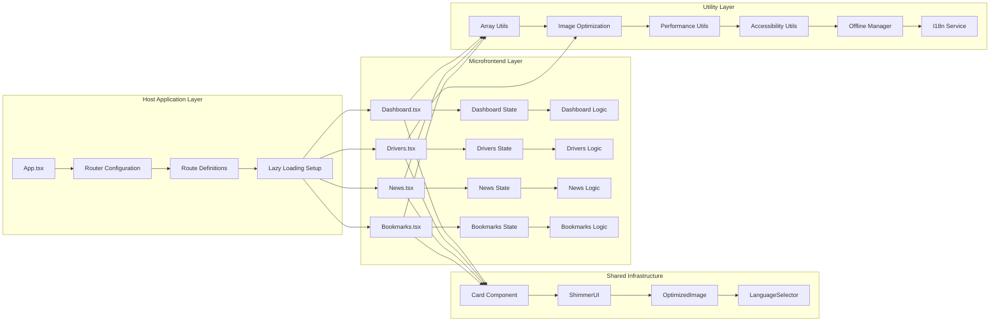
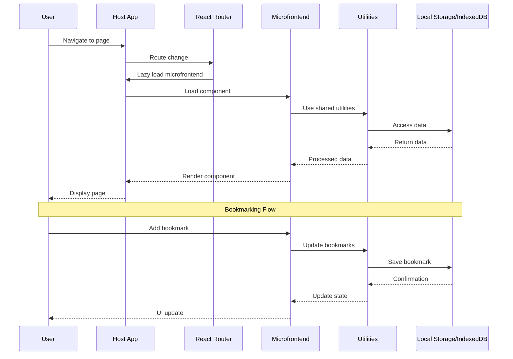
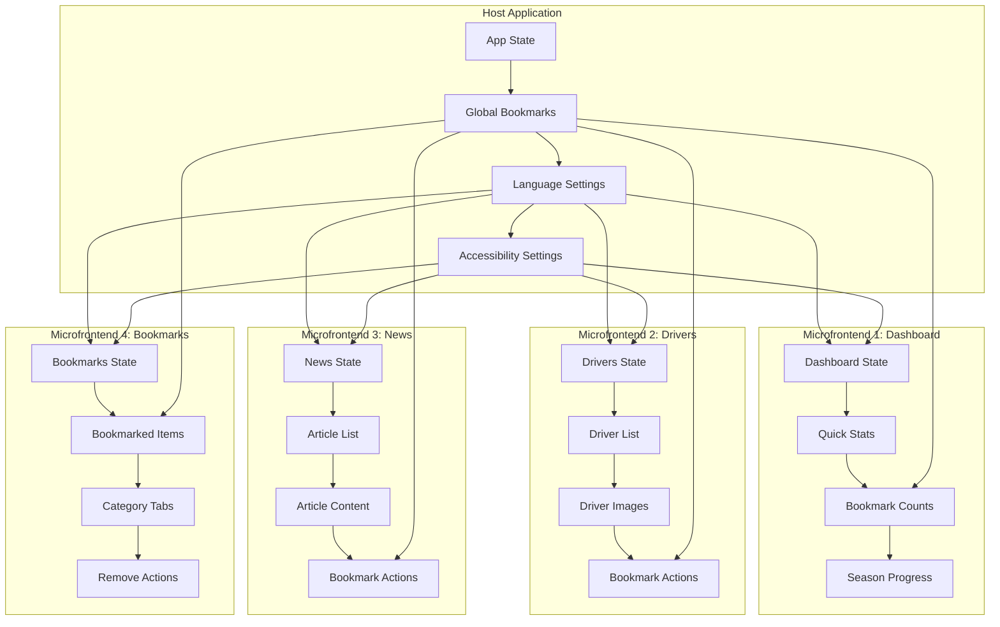
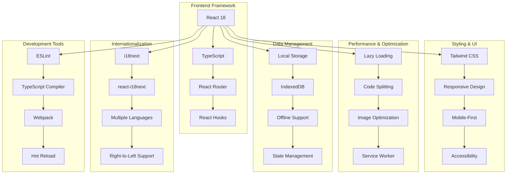
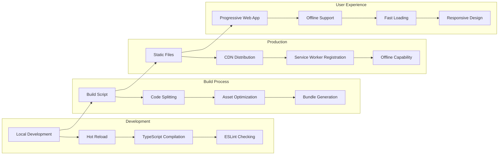

# ABC Racing - Microfrontend Architecture Diagram

## Overview
The ABC Racing application implements a microfrontend architecture with a host application that dynamically loads independent microfrontends for different features.

## Architecture Diagram

```mermaid
graph TB
    subgraph "Host Application (App.tsx)"
        A[App Component] --> B[Router]
        B --> C[Navigation]
        B --> D[Global Controls]
        D --> E[Accessibility Controls]
        D --> F[Offline Controls]
        D --> G[Language Selector]
    end

    subgraph "Microfrontends"
        H[Dashboard Microfrontend]
        I[Drivers Microfrontend]
        J[News Microfrontend]
        K[Bookmarks Microfrontend]
    end

    subgraph "Shared Components"
        L[Card Component]
        M[ShimmerUI Component]
        N[OptimizedImage Component]
        O[LanguageSelector Component]
    end

    subgraph "Utilities & Services"
        P[Array Utils]
        Q[Image Optimization]
        R[Performance Optimization]
        S[Accessibility Utils]
        T[Offline Manager]
        U[I18n Service]
    end

    subgraph "Data Layer"
        V[Bookmarks State]
        W[Offline Storage]
        X[Localization Data]
    end

    %% Host to Microfrontends connections
    A --> H
    A --> I
    A --> J
    A --> K

    %% Microfrontends to shared components
    H --> L
    H --> M
    I --> L
    I --> M
    I --> N
    J --> L
    J --> M
    K --> L
    K --> M

    %% Microfrontends to utilities
    H --> P
    I --> Q
    J --> P
    K --> P

    %% Global controls to utilities
    E --> S
    F --> T
    G --> U

    %% Data connections
    H --> V
    I --> V
    J --> V
    K --> V
    F --> W
    G --> X

    %% Styling
    classDef host fill:#e1f5fe
    classDef microfrontend fill:#f3e5f5
    classDef shared fill:#e8f5e8
    classDef utility fill:#fff3e0
    classDef data fill:#fce4ec

    class A,B,C,D,E,F,G host
    class H,I,J,K microfrontend
    class L,M,N,O shared
    class P,Q,R,S,T,U utility
    class V,W,X data
```



## Detailed Component Architecture



## Data Flow Diagram



## File Structure Diagram

```
src/
├── App.tsx                          # Host Application
├── index.tsx                        # Entry Point
├── index.css                        # Global Styles
│
├── components/                      # Shared Components
│   ├── Navigation.tsx              # Main Navigation
│   ├── Card.tsx                    # Reusable Card Component
│   ├── ShimmerUI.tsx               # Loading Component
│   ├── OptimizedImage.tsx          # Image Optimization
│   ├── LanguageSelector.tsx        # Language Selection
│   ├── AccessibilityControls.tsx   # Accessibility Features
│   ├── OfflineControls.tsx         # Offline Management
│   ├── DuplicateRemover.tsx        # Array Utilities Demo
│   └── SimpleDuplicateExamples.tsx # Simple Examples
│
├── microfrontends/                  # Independent Microfrontends
│   ├── Dashboard.tsx               # Dashboard Feature
│   ├── Drivers.tsx                 # Drivers Management
│   ├── News.tsx                    # News Articles
│   └── Bookmarks.tsx               # Bookmarks Management
│
├── utils/                          # Shared Utilities
│   ├── arrayUtils.ts               # Array Operations
│   ├── imageOptimization.ts        # Image Processing
│   ├── performanceOptimization.ts  # Performance Tools
│   ├── accessibility.ts            # Accessibility Features
│   └── offlineManager.ts           # Offline Capabilities
│
├── i18n/                          # Internationalization
│   ├── index.ts                    # I18n Configuration
│   └── locales/                    # Translation Files
│       ├── en.json
│       ├── es.json
│       ├── fr.json
│       └── ... (other languages)
│
└── public/                        # Static Assets
    ├── index.html
    ├── manifest.json
    ├── sw.js                      # Service Worker
    └── offline.html               # Offline Fallback
```

## Microfrontend Communication Pattern



## Technology Stack Architecture



## Deployment Architecture



## Key Features Implementation

### 1. **Lazy Loading Implementation**
```typescript
// App.tsx - Lazy loading setup
const Dashboard = React.lazy(() => import('./microfrontends/Dashboard'));
const Drivers = React.lazy(() => import('./microfrontends/Drivers'));
const News = React.lazy(() => import('./microfrontends/News'));
const Bookmarks = React.lazy(() => import('./microfrontends/Bookmarks'));
```

### 2. **Shared State Management**
```typescript
// Global bookmarks state shared across microfrontends
const [bookmarks, setBookmarks] = useState<BookmarksState>({
  drivers: [],
  news: [],
  races: []
});
```

### 3. **Component Communication**
```typescript
// Microfrontends communicate through props and context
<Dashboard 
  bookmarks={bookmarks}
  onBookmarkToggle={handleBookmarkToggle}
/>
```

### 4. **Utility Sharing**
```typescript
// Shared utilities across all microfrontends
import { removeDuplicates, useUniqueArray } from '../utils/arrayUtils';
import { OptimizedImage } from '../components/OptimizedImage';
```

## Benefits of This Architecture

1. **Modularity**: Each microfrontend is independent and can be developed/deployed separately
2. **Scalability**: Easy to add new features as separate microfrontends
3. **Performance**: Lazy loading reduces initial bundle size
4. **Maintainability**: Clear separation of concerns
5. **Reusability**: Shared components and utilities
6. **Team Collaboration**: Different teams can work on different microfrontends
7. **Technology Flexibility**: Each microfrontend can use different technologies if needed

## Best Practices Implemented

1. **Code Splitting**: Each microfrontend is loaded on demand
2. **Shared Dependencies**: Common utilities and components are shared
3. **Type Safety**: Full TypeScript implementation
4. **Performance Optimization**: Image optimization, lazy loading, service worker
5. **Accessibility**: AAA-level accessibility support
6. **Internationalization**: Multi-language support
7. **Offline Support**: Service worker and IndexedDB for offline functionality
8. **Responsive Design**: Mobile-first approach with progressive enhancement

